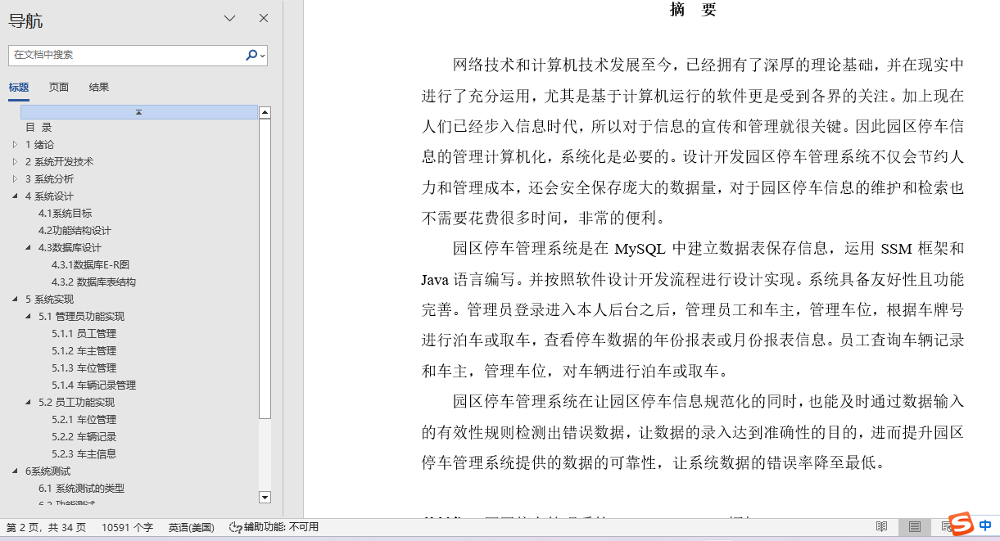
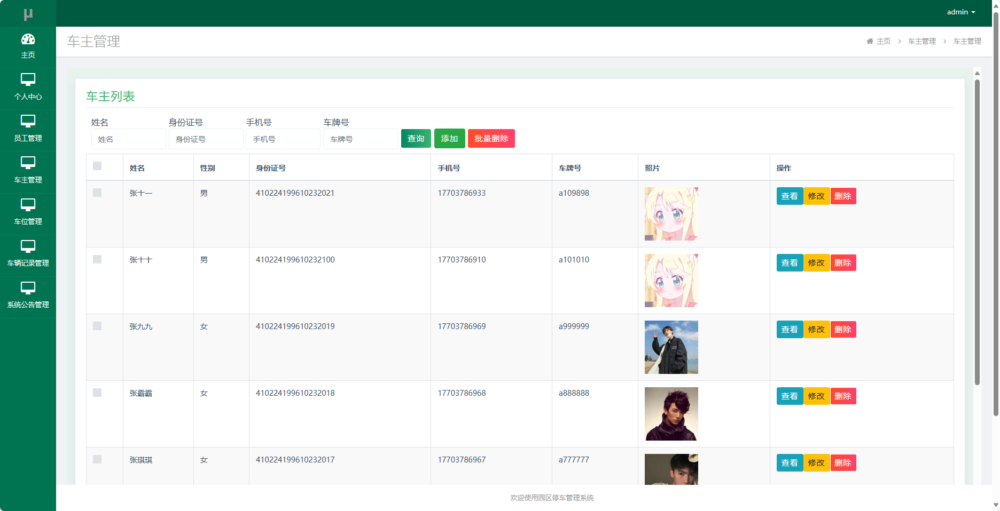
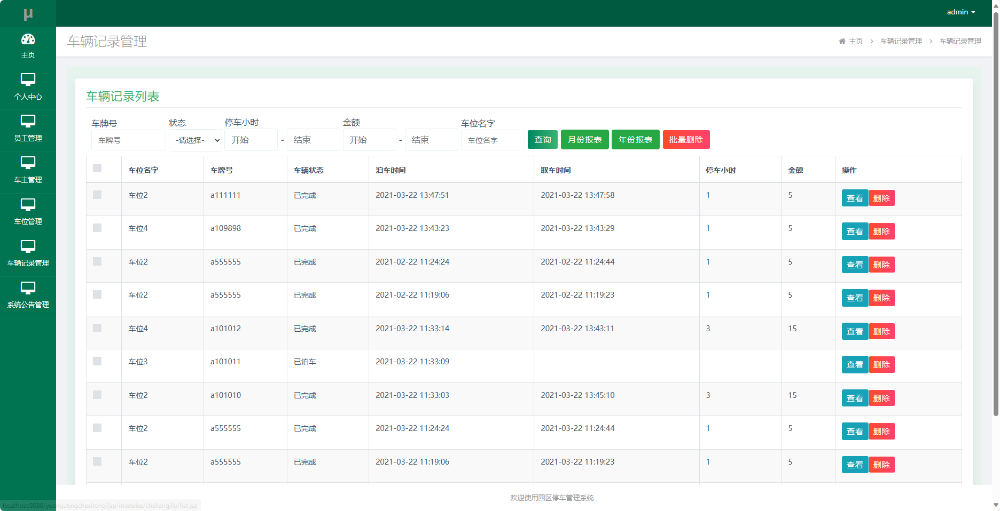
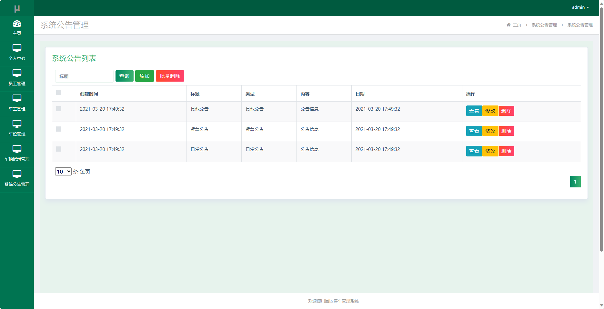
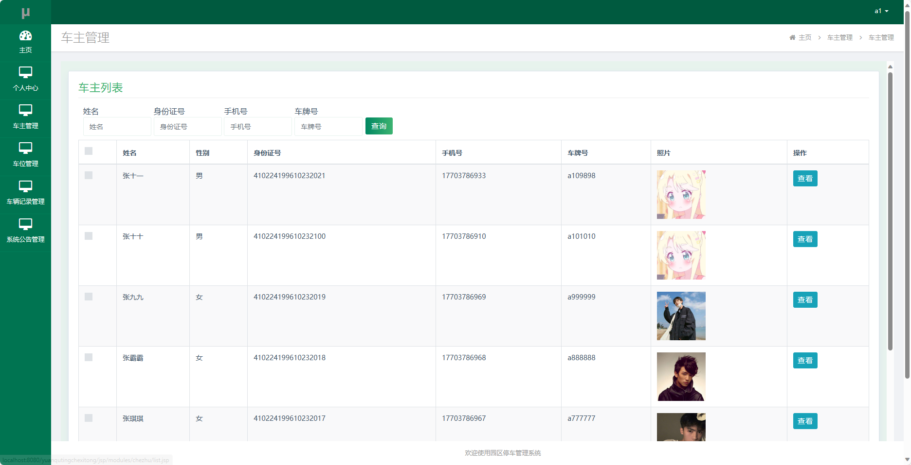
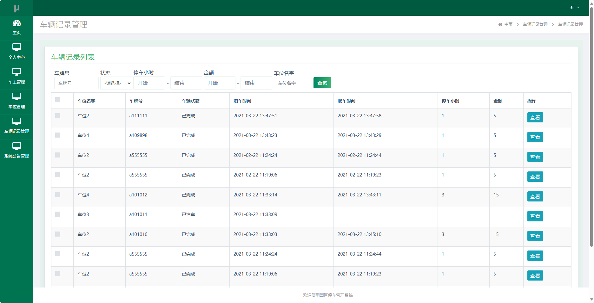
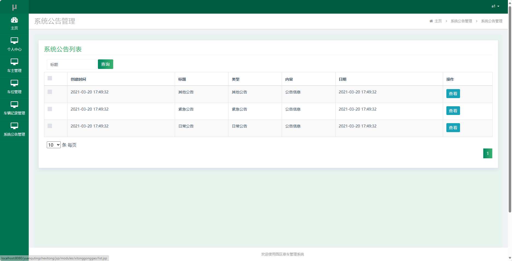
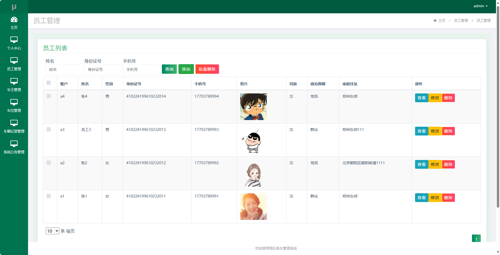

## 基于SSM框架实现的园区停车管理系统(程序+报告)

- <b>完整代码获取地址：从戎源码网 ([https://armycodes.com/](https://armycodes.com/))</b>
- <b>技术探讨、资料分享，请加QQ群：692619798</b> 
- <b>作者微信：19941326836  QQ：952045282</b> 
- <b>承接计算机毕业设计、Java毕业设计、Python毕业设计、深度学习、机器学习</b>
- <b>选题+开题报告+任务书+程序定制+安装调试+论文+答辩ppt 一条龙服务</b>
- <b>所有选题地址 ([https://github.com/YuLin-Coder/AllProjectCatalog](https://github.com/YuLin-Coder/AllProjectCatalog)) </b>

## 项目介绍
基于SSM框架实现的园区停车管理系统，系统包含两种角色：管理员、用户,系统分为前台和后台两大模块，主要功能如下。
【用户】：
1. 个人中心：用户可以查看和管理个人信息，包括用户名、手机号码、车牌号等，还可以修改密码和联系方式。
2. 车主管理：用户可以查看自己的车辆信息，包括车牌号、车型、车主姓名等，还可以添加、编辑和删除车辆信息。
3. 车位管理：用户可以查看停车场的车位信息，包括车位编号、所属区域、是否可用等，还可以查找空闲车位并进行预约。
4. 车辆记录管理：用户可以查看自己的停车记录，包括停车时间、停车费用、停车时长等，还可以查看历史停车记录。
5. 系统公告管理：用户可以查看系统发布的公告信息，包括停车规则、临时停车通知等，确保用户了解停车规定和通知事项。

【管理员】：
1. 个人中心：管理员可以查看和管理个人信息，包括用户名、手机号码、员工编号等，还可以修改密码和联系方式。
2. 员工管理：管理员可以管理系统中的员工信息，包括添加、编辑和删除员工账号，控制员工的访问权限和角色。
3. 车主管理：管理员可以查看和管理车主信息，包括车主姓名、手机号码、车牌号等，还可以添加、编辑和删除车主信息。
4. 车位管理：管理员可以管理停车场的车位信息，包括添加、编辑和删除车位，设置车位所属区域和是否可用等。
5. 车辆记录管理：管理员可以查看和管理车辆停车记录，包括停车时间、车辆信息、停车费用等，还可以查询和导出停车记录。
6. 系统公告管理：管理员可以发布系统公告信息，包括停车规则、临时停车通知等，确保用户及时了解停车相关规定和通知事项。

## 项目技术
- 编程语言：Java
- 数据库：MySQL
- 前端技术：JSP、JavaScript、jquery
- 后端技术：Spring、SpringMVC、MyBatis

## 运行环境
- JDK版本：JDK1.8及以上
- 开发工具：IDEA、Ecplise、Myecplise都可以
- 数据库: MySQL5.7及以上

## 运行截图

